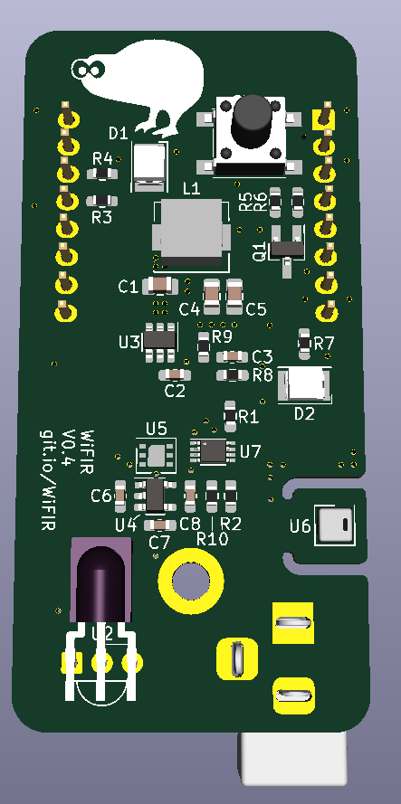
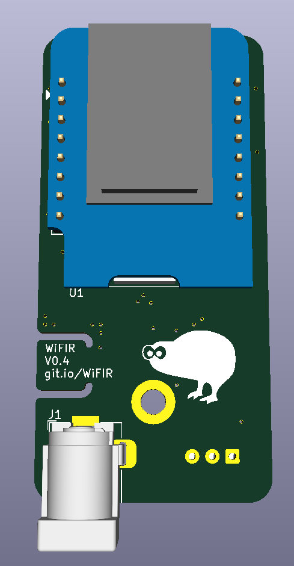

# WiFI*R*

The WiFI*R* is a WiFi IR blaster / remote, based around a WeMos D1 mini (ESP8266)

The repo is split into hardware and firmware sub-folders:

* **Firmware:** The firmware as a PlatformIO project
* **Hardware:**
  * **PCB:** The KiCAD project for the PCB
  * **Case:** The project files for the 3D printed case

This project came about, as I needed to be able to remotely control a heat-pump / aircon, to pre-condition a summer house before arriving in the cold winter :)

[Interactive BOM](https://WiFIR.github.io/pcb/docs/ibom.html)
